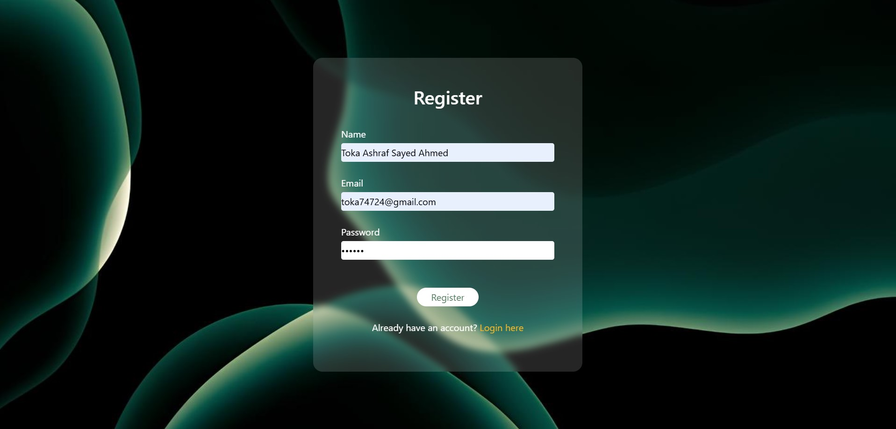

A simple web-based authentication system using **HTML, CSS, and JavaScript**.  
Users can **register**, **log in**, and view their profile
## 🚀 Live Demo
https://tokaashraf1.github.io/Authentication-System/

**Register Page**
 

## 🚀 Features
- **Bootstrap** for styling.
- User **Registration** with localStorage.
- User **Login** with validation.
- **Profile Page** displaying user details.
- **Logout** functionality.

